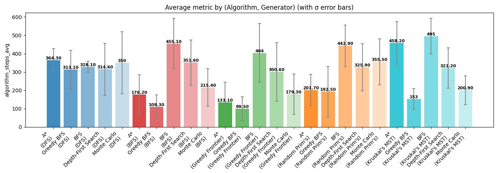
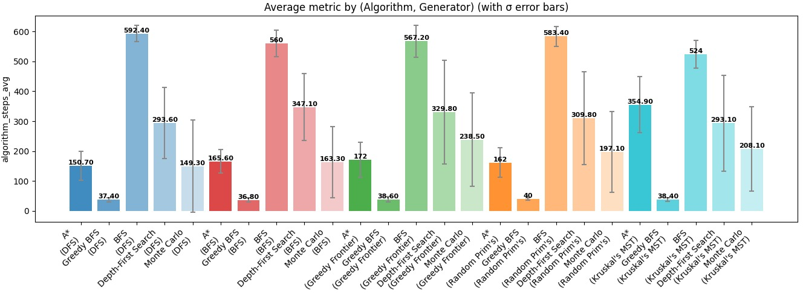
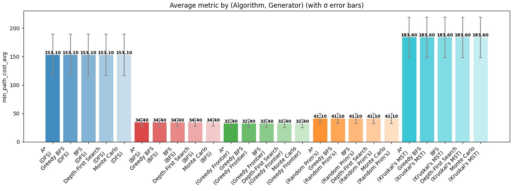
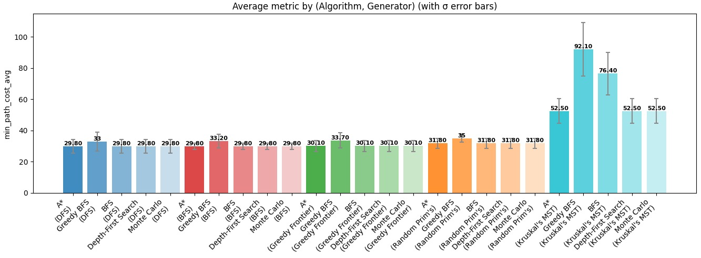
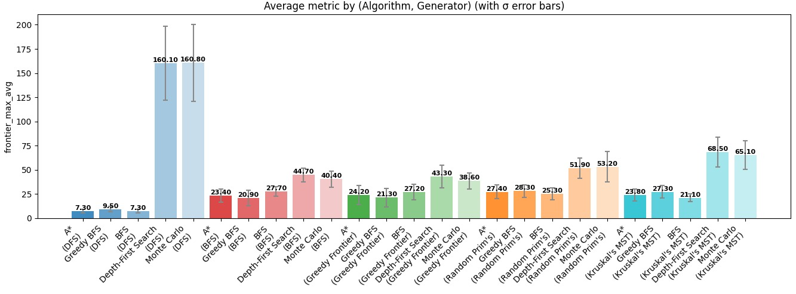
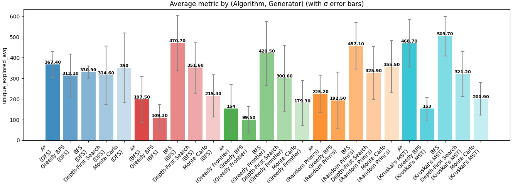
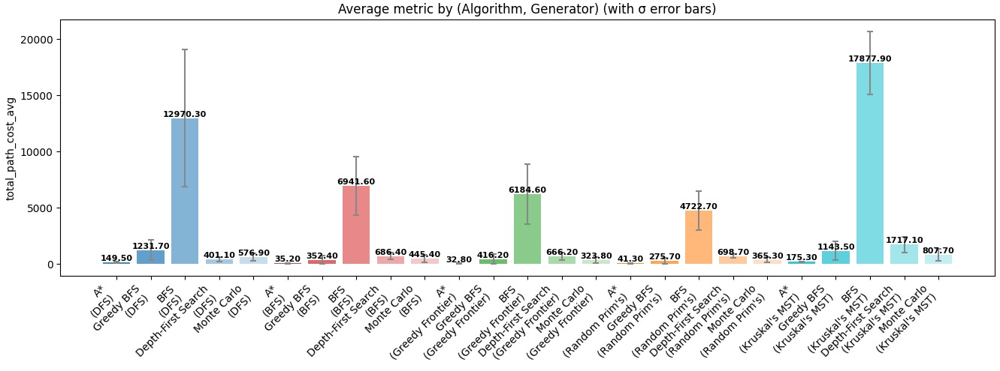

# A-Mazing Race: Maze Generation and Solving Algorithms

This project is an **interactive visualization and analysis suite** for exploring how different **maze generation** and **pathfinding algorithms** behave, perform, and compare.

You can:
- **Generate** unique mazes using multiple spanning-tree algorithms (DFS, BFS, Prim’s, Kruskal’s, Greedy Frontier).  
- **Solve** mazes visually using algorithms like A*, BFS, DFS, and Greedy BFS.  
- **Benchmark** their performance through a metrics simulator and dashboard.

---

## Maze Generation Algorithms
Maze generation can be thought of as **building a connected graph** with no cycles (a *tree*) over a grid.  
Each algorithm carves passages in its own unique style, influencing maze “texture,” path length, and solver difficulty.

---

### 1. Depth-First Search (DFS)

**Concept:**  
Starts at a random cell and explores as deep as possible before backtracking.  
It’s like walking through a cave system, always picking a random unexplored tunnel until you hit a dead end, then retracing your steps to find a new tunnel.

**How it works:**
1. Choose a random start cell and mark it visited.  
2. Randomly pick an unvisited neighbor, remove the wall between them, and move there.  
3. Repeat until there are no unvisited neighbors, then *backtrack*.

**Properties:**
- Produces long, winding corridors.
- Few branches → feels “linear.”
- Easy to implement recursively (or with a stack).
---
### 2. Breadth-First Search (BFS)

**Concept:**  
Expands outward evenly from the start, like ripples in water.  
Instead of exploring one path deeply, it explores all paths at a given “depth” first.

**How it works:**
1. Start with a queue containing the first cell.  
2. Remove a cell from the queue, carve to an unvisited neighbor, and enqueue that neighbor.  
3. Continue until all cells are visited.

**Properties:**
- Creates mazes with lots of short branches.
- Feels “open” with multiple route options.
- Guaranteed to visit all cells.
---

### 3. Greedy Generation

**Concept:**  
A hybrid between DFS and Prim’s that prioritizes cells **closest to a goal**.  
Imagine a maze that “pulls” itself toward the exit during generation.

**How it works:**
1. Pick a start and goal cell.  
2. Keep a “frontier list” of boundary cells.  
3. Always expand the frontier cell **closest to the goal** (by Manhattan distance).  
4. Randomize within equal distances to keep variation.

**Properties:**
- Produces directional mazes.
- More predictable corridor flow toward the goal.
---

### 4. Prim’s Algorithm (Weighted Minimum Spanning Tree)

**Concept:**  
Treats each wall as an *edge with a weight*, connecting cells like a graph.  
It gradually connects regions using the lightest available edge—like building cheap roads between towns.

**How it works:**
1. Start from a random cell and add its neighboring walls (edges) to a priority queue.  
2. Repeatedly choose the wall with the smallest weight.  
3. If it connects a visited cell to an unvisited one, remove the wall and add the new cell’s walls.

**Properties:**
- Creates balanced mazes, not too linear or too branched.
- Edges can have physical meaning (e.g., terrain cost, resistance).
---

### 5. Kruskal’s Algorithm (Weighted Union–Find)
**Concept:**  
Kruskal’s algorithm views maze construction as connecting sets of cells without creating loops.  
Think of every cell as an “island,” and each wall between them as a “bridge.”  
It builds bridges in order of increasing cost until all islands are connected.

**How it works:**
1. Treat all possible walls as weighted edges.  
2. Sort edges by weight.  
3. For each edge, connect the cells only if they’re in different sets (to avoid cycles).  
4. Merge their sets (union-find).

**Properties:**
- Produces uniform, fair mazes.
- Naturally models weighted environments.
---

## Pathfinding & Maze Solving Algorithms

Each solver class (`Robot`) operates step-by-step, updating the robot’s position and internal map.  
The algorithms differ in **how they explore**, **how much memory they need**, and **whether they guarantee the shortest path**.

---
### 1. Depth-First Search (DFS) Solver
- Explores as deep as possible before backtracking.
- Great for exploring all paths but inefficient for finding short ones.
- Easy to visualize: a “snaking” path that slowly fills the maze.
---
### 2. Breadth-First Search (BFS) Solver
- Expands outward evenly in “waves.”
- Guaranteed to find the shortest path in an unweighted maze.
---
### 3. Greedy Best-First Search
- Uses a heuristic (Manhattan distance to goal).  
- Chooses whichever cell looks closest to the goal, ignoring real distance.
---
### 4. Monte Carlo
- Uses randomized simulation to explore possible paths and gradually learn which directions are most successful.
- Instead of following a strict rule like A* or BFS, it performs multiple random rollouts from the current position and tracks how often each move leads closer to the goal.
- Over time, moves that statistically perform better are chosen more frequently, creating a probabilistic search pattern that improves with experience.
---
### 5. A* Search
- The gold standard for pathfinding.
- Combines **actual cost (g)** and **estimated cost to goal (h)**:
  ```
  f(n) = g(n) + h(n)
  ```
- Expands the cell with the smallest `f(n)` first.

**How it works:**
1. Start with open set = {start}.  
2. Pick node with smallest `f(n)`.  
3. For each neighbor, calculate cost; update if better.  
4. Continue until reaching goal.
---
### 6. Monte Carlo Search
- Instead of deterministic exploration, it randomly simulates many paths.
- Each trial contributes a “score” that influences which directions to try next.
- Mimics reinforcement learning: success biases future choices.
---

## Metrics and Visualization
### **metrics_simulator.py**
Runs repeated trials to collect averages for:
- Execution time
- Steps taken
- Nodes expanded
- Frontier size
- Path length and cost  
Results are exported as `.csv` for later plotting.

### **metrics_app.py**
Interactive GUI for:
- Selecting algorithms and generators  
- Running batch simulations  
- Viewing results as tables or charts  
- Filtering by generator or solver type
---

## Running the Project

## Dependencies
```bash
pip install pygame numpy matplotlib
```
---

### Complete Module
```bash
python complete_file.py
```

### Metrics Simulation
```bash
python metrics_simulator.py --width 25 --height 25 --runs 50
```

### GUI Dashboard
```bash
python metrics_app.py
```
---

## Additional Metrics

Beyond standard pathfinding and solver performance, the `Maze` class supports **custom metrics** that capture structural and weighted properties of the maze itself. These include:

- **Node and Edge Weights:**  
  - `node_weights` store the cost to **enter each cell**, useful for modeling difficult terrain.  
  - `edge_weights` store the cost to **move between two adjacent cells**, used by MST-based generation (e.g., Kruskal’s).  
  - Metrics such as total cost, average weight, or maximum weight along a path can be calculated to analyze maze difficulty.

- **Path Cost Metrics:**  
  - Using `weight_type` (`node` or `edge`), solvers can compute **total path cost**, **minimum/maximum path costs**, and **variance of path cost**.  
  - This allows comparison of solver performance under weighted versus uniform mazes.

- **Loop Density:**  
  - By specifying `loop_percent` when generating a maze, you can measure the fraction of extra walls removed.  
  - High loop density creates multiple paths between points, affecting solver performance and path optimality.

- **Reward Distribution:**  
  - The `rewards` set tracks collectible items in the maze.  
  - Metrics include number of rewards, average distance between rewards, or distance from start/goal.  
  - These are useful for evaluating exploration efficiency or designing challenge layouts.

## Results

The following graphs compare pairs of 25×25 maze generation and solving algorithms on different parameters, indicated on the y-axis, with added variations after 10 simulation runs. Generation algorithms are color-coded, and solving algorithms are lightly coded. Standard deviation is represented with error bars.

### Figure 1: Algorithm Steps on Default Maze



*Number of iterations required by each algorithm (algorithm_steps) on the default maze setting (no loops).*

---

### Figure 2: Algorithm Steps with Loops



*Number of iterations required by each algorithm (algorithm_steps) on a maze with 60% loops added.*

---

### Figure 3: Minimum Path Cost on Default Maze



*The cost of the shortest path found by each algorithm (min_path_cost) on the default maze setting (no loops).*

---

### Figure 4: Minimum Path Cost on Maze with Loops



*The cost of the shortest path found by each algorithm (min_path_cost) on a maze with 60% loops added.*

---

### Figure 5: Frontier Size on Default Maze



*The number of look-ahead nodes kept in memory by each algorithm during path-finding (frontier_max) on the default maze setting.*

---

### Figure 6: Unique Cells Explored on Default Maze



*The number of unique cells visited by each algorithm during path-finding (unique_explored) on the default maze setting.*

---

### Figure 7: Total Path Cost with Full Vision



*Total path cost accumulated by each algorithm when they have full vision across the maze in advance.*


## General Conclusions

We acquired some interesting insights by comparing algorithm performance both within and across maze types. Some of them are:

- **Maze Generation vs. Solver Efficiency**
  - We initially theorized that an algorithm would solve a maze most efficiently if it also generated it.  
  - **Observation:** This is not always true (Figure 1). For example, BFS-generated mazes are narrow and hollow-like, making early hallway navigation inefficient compared to other algorithms.

- **Average Steps**
  - Across most maze generators, the average number of steps from start to destination is around **30**, making comparisons fair for most algorithms. **Kruskal-generated mazes** are exceptions, since they require noticeably more steps due to their scattered MST formation structure, increasing solving difficulty (Figure 1).

- **Effect of Loops**
  - With **more open loops** (multiple possible solutions), **BFS takes significantly more steps**, but remains the most consistent solver (Figure 2).  
  - **Greedy BFS** performs **worst in finding the shortest path**, especially when the mazes have loops (Figure 3 and 4).

- **Maze Structure and Solver Efficiency**
  - On **weighted graphs**, all algorithms perform worse overall, but **Prim-generated mazes** are easier to solve than Kruskal-generated mazes due to their difference in MST formation (Figures 1 and 2).  
  - **BFS-generated mazes** are narrow and hollow-like, causing inefficient switching in early hallway sections and large deviations in steps depending on reward location (Figure 1).  

- **Correlation of Metrics**
  - There is a **strong positive correlation** between **unique cells explored** and **algorithm steps**: fewer steps correspond to smaller explored areas and faster solutions (Figures 1 and 6).  
  - Algorithms that explore more nodes maintain larger **frontier sizes**, consistent with increased steps (Figure 5).

- **Human-Like Intuition**
  - **Greedy BFS** generally performs best in terms of speed, taking the fewest steps or iterations. It also closely resembles how humans intuitively solve mazes, as it moves directly toward the goal based only on its current position.
  - **Limitation:** In mazes with **fewer open loops** (e.g., DFS-generated mazes with a long single correct path), Greedy BFS is slower, while other algorithms are less affected (Figures 1 and 2).

- **Correlation of Metrics**
  - Many metrics are **positively correlated**: exploring more nodes naturally requires more algorithmic iterations, leading to longer solution times (Figures 1 and 6).  
  - Algorithms that explore more nodes also maintain larger **frontier sizes** during path-finding (Figure 5).

Overall, our analysis demonstrates that maze-solving efficiency depends not only on the choice of algorithm but also on the structural properties of the maze itself. Metrics such as unique cells explored, frontier size, and total steps also provide complementary insights into solver behavior, highlighting trade-offs between exploration thoroughness and speed. 
